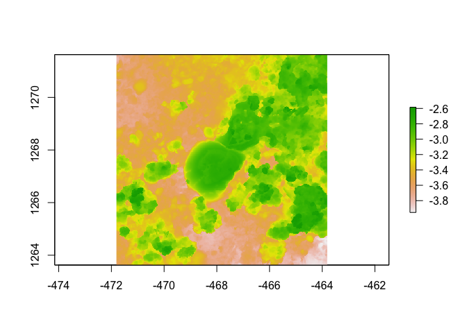

Assignment
================
Callie Stephenson
2023-08-17

``` r
########## Load Libraries 
# Load packages raster, habtools, ggplot2, dplyr, fishualize
library(raster)
```

    ## Loading required package: sp

    ## The legacy packages maptools, rgdal, and rgeos, underpinning the sp package,
    ## which was just loaded, will retire in October 2023.
    ## Please refer to R-spatial evolution reports for details, especially
    ## https://r-spatial.org/r/2023/05/15/evolution4.html.
    ## It may be desirable to make the sf package available;
    ## package maintainers should consider adding sf to Suggests:.
    ## The sp package is now running under evolution status 2
    ##      (status 2 uses the sf package in place of rgdal)

``` r
library(habtools)
```

    ## 
    ## Attaching package: 'habtools'

    ## The following object is masked from 'package:raster':
    ## 
    ##     extent

``` r
library(ggplot2)
library(dplyr)
```

    ## 
    ## Attaching package: 'dplyr'

    ## The following objects are masked from 'package:raster':
    ## 
    ##     intersect, select, union

    ## The following objects are masked from 'package:stats':
    ## 
    ##     filter, lag

    ## The following objects are masked from 'package:base':
    ## 
    ##     intersect, setdiff, setequal, union

``` r
library(fishualize)

#### test that habtools loaded appropriately
plot(horseshoe)
```

    ## Warning in sp::CRS(...): sf required for evolution_status==2L

    ## Warning in sp::CRS(...): sf required for evolution_status==2L

<!-- -->

### Current lab

Donahue Lab

### Project focus

Thesis work is on effects of submarine groundwater discharge (a natural
environmental gradient) on coral reef ecosystem functioning.
Specifically looking at fish community structure and coral growth /
health.

### Why you chose this course

I believe furthering my understanding of how structure relates to
ecosystem functioning will enhance my ability to ask scientific
questions related to the topics. This subject matter relates to my
current projects and long-term career goals.

### What do you want to learn about the most in this course

The techniques commonly used to test and analyze questions related to
ecosystem functioning vs. the ecosystem’s structure.

### Your R experience

Light, have taken MBIO 612 (Data Science Fundamentals in R) and can get
by, but I get by with a little help from my friends.

### Fun fact

I do a back handspring every six months to make sure I still can (I
still can)
